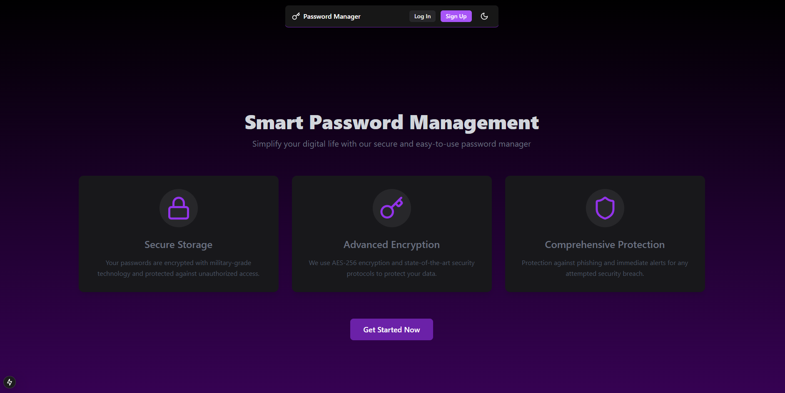
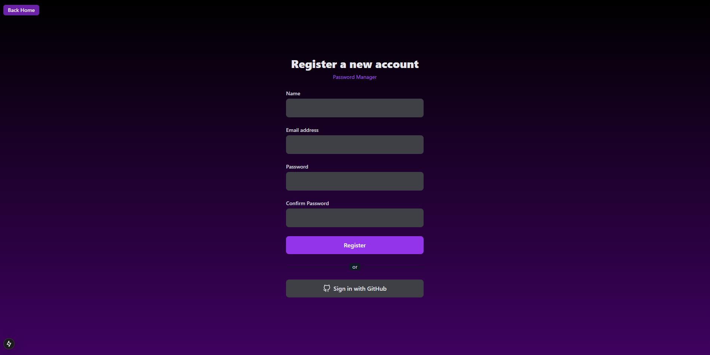
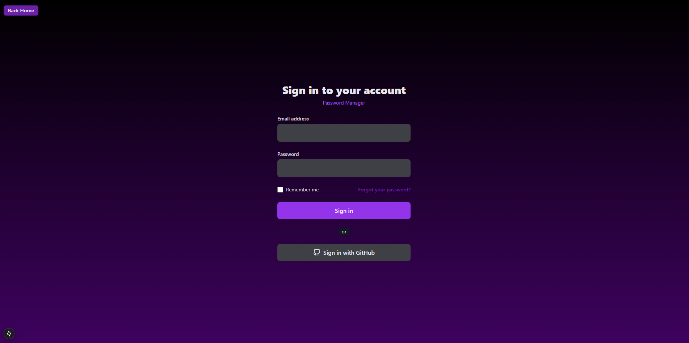
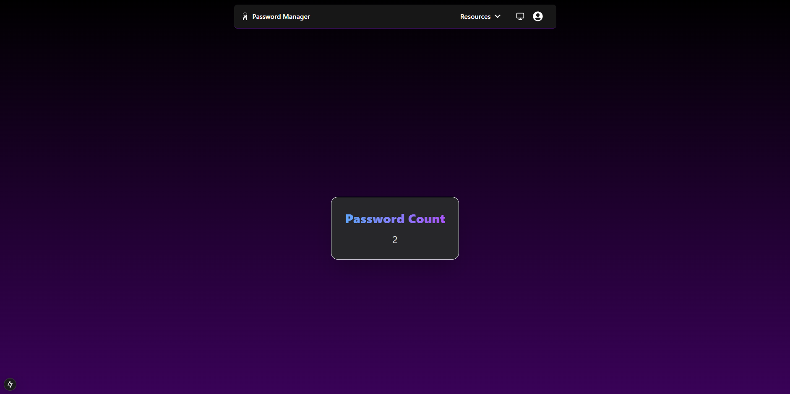
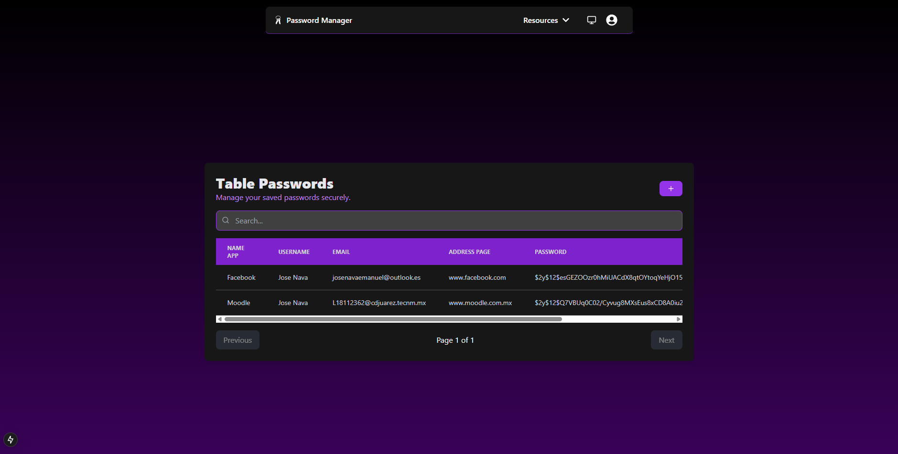
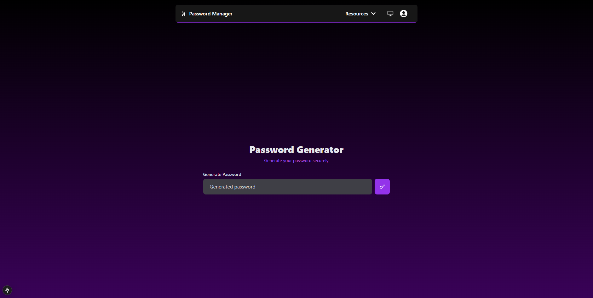

<p align="center">
  <a href="https://nextjs.org" target="_blank">
    
  </a>
  &nbsp;&nbsp;&nbsp;&nbsp;
  <a href="https://laravel.com" target="_blank">
    
  </a>
</p>

# Proyecto Next.js con API RESTful de Laravel "Password Manager"

Este proyecto es complemento de una **API RESTful** creada anteriormente con **Laravel**. Utiliza **Sanctum** para la autenticación de usuarios, permitiendo un acceso seguro mediante tokens en un login. Su principal función es interpretar y manipular los datos de un backend por medio de un frontend para que el usuario tenga la mejor experiencia de usuario al manipular el backend.

## Características

- **Autenticación segura**: Implementación de autenticación basada en tokens con Laravel Sanctum.
- **CRUD completo**: Operaciones de creación, lectura, actualización y eliminación para los recursos de las tareas asignadas.
- **UI minimalisata**: Obtado por una mejor experiecia de usuario.

## Requisitos previos

- Laravel (Backend)
- Node.js 

## Instalación

1. Clona y configura el backend de la API RESTful:
   ```bash
   git clone https://github.com/JoseNava100/laravel-api-password-manager
   cd laravel-api-password-manager
   ```

2. Clona el frontend:
   ```bash
   git clone https://github.com/JoseNava100/password-app
   cd password-app
   ```

3. Instala las dependencias de Node.js:
   ```bash
   npm install
   ```

4. Ejecuta la aplicación:
   ```bash
   npm run dev
   ```

## Creador

Este proyecto fue creado por [JoseNava100](https://github.com/JoseNava100).

### Página de Inicio

*Página principal de la aplicación, donde se presenta una breve descripción del proyecto, lo que ofrece y se tiene enlaces para registrarse o iniciar sesión.*

### Página de Registro

*Interfaz de registro para nuevos usuarios. Los campos solicitados incluyen nombre, correo electrónico y contraseña.*

### Página de Inicio de Sesión

*Interfaz de inicio de sesión para usuarios registrados. Los usuarios pueden ingresar su correo electrónico y contraseña para acceder al dashboard.*

### Dashboard Widget

*Vista del dashboard después de iniciar sesión. Aquí los usuarios pueden gestionar sus tareas, ver estadísticas y acceder a otras funcionalidades de la aplicación, que proximamente seran añadidas.*

### Passwords

*Vista del la gestion de contraseñas*

### Generate

*Vista del generador de contraseñas.*